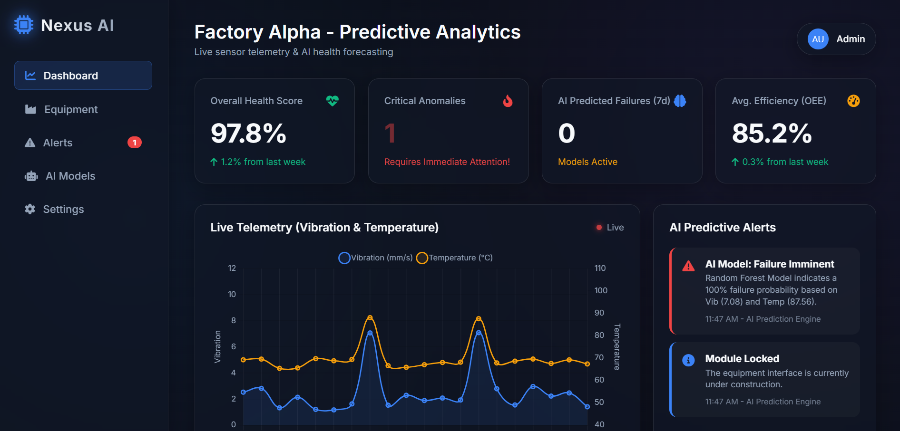
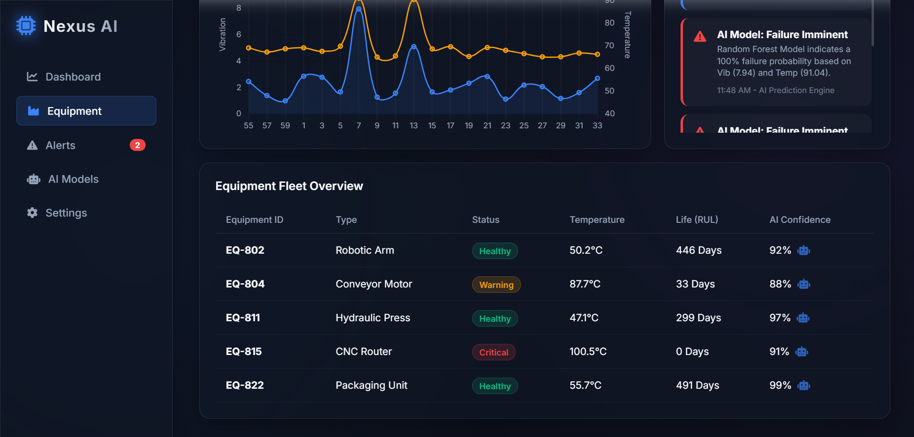

# 🏭 Factory Alpha – Predictive Analytics Dashboard

## 📌 Overview
Factory Alpha is a full-stack predictive analytics system designed for industrial environments. It collects real-time machine sensor data through APIs, processes it using machine learning models, and provides live insights via a dashboard.

The system enables predictive maintenance, helping industries detect failures early, reduce downtime, and improve operational efficiency.

---
## 📊 Dashboard Preview

<p align="center">
  
</p>

<p align="center">
  
</p>

---

## 🚀 Key Features
- Real-time sensor data collection via API  
- AI-based predictive maintenance system  
- Live dashboard visualization  
- Data storage using SQLite database  
- FastAPI backend for efficient processing  
- Pre-trained model loading using Joblib  
- Failure prediction and monitoring  

---

## 🛠️ Tech Stack
- Frontend: HTML, CSS, JavaScript  
- Backend: FastAPI (Python)  
- Machine Learning: Scikit-learn  
- Data Processing: Pandas, NumPy  
- Database: SQLite  
- Model Storage: Joblib  

---

## 🤖 Machine Learning Workflow
- Data is collected via API and stored in SQLite (`telemetry.db`)  
- Data is processed using Pandas & NumPy  
- Model is trained using Scikit-learn (`train_model.py`)  
- Trained model is saved as `model.joblib`  
- API loads model and performs real-time predictions  

---

## ▶️ Running the Project

### Start Backend (FastAPI)
```bash
uvicorn api:app --reload
